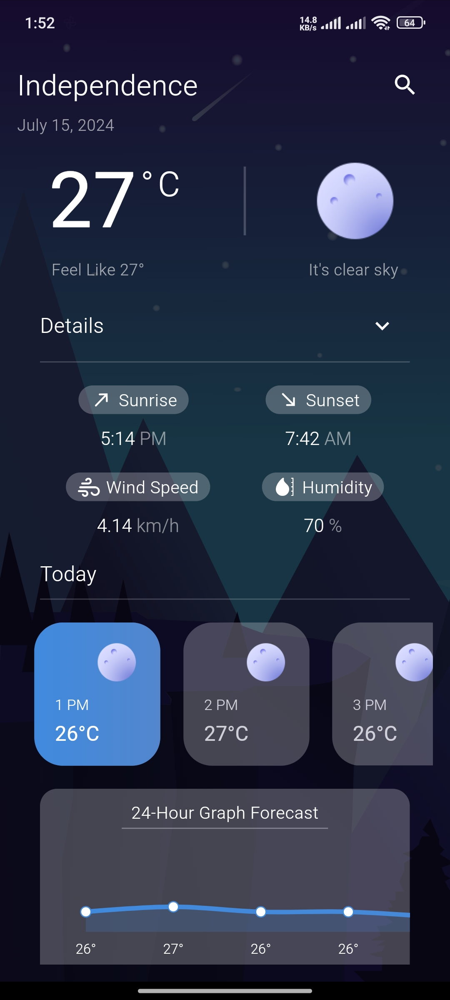

# Modern Weather App.

Modern weather app manage with GetX state management.

# Features

<ol>
    <li>
        Using GetX state management.
    </li>
    <li>
        Background animation changes based on current weather.
    </li>
    <li>
        Using Geolocator for user current location auto detect.
    </li>
</ol>

## Screenshots

    
    
    
    
    

A few resources to get you started if this is your first Flutter project:

- [Lab: Write your first Flutter app](https://docs.flutter.dev/get-started/codelab)
- [Cookbook: Useful Flutter samples](https://docs.flutter.dev/cookbook)

For help getting started with Flutter development, view the
[online documentation](https://docs.flutter.dev/), which offers tutorials,
samples, guidance on mobile development, and a full API reference.
